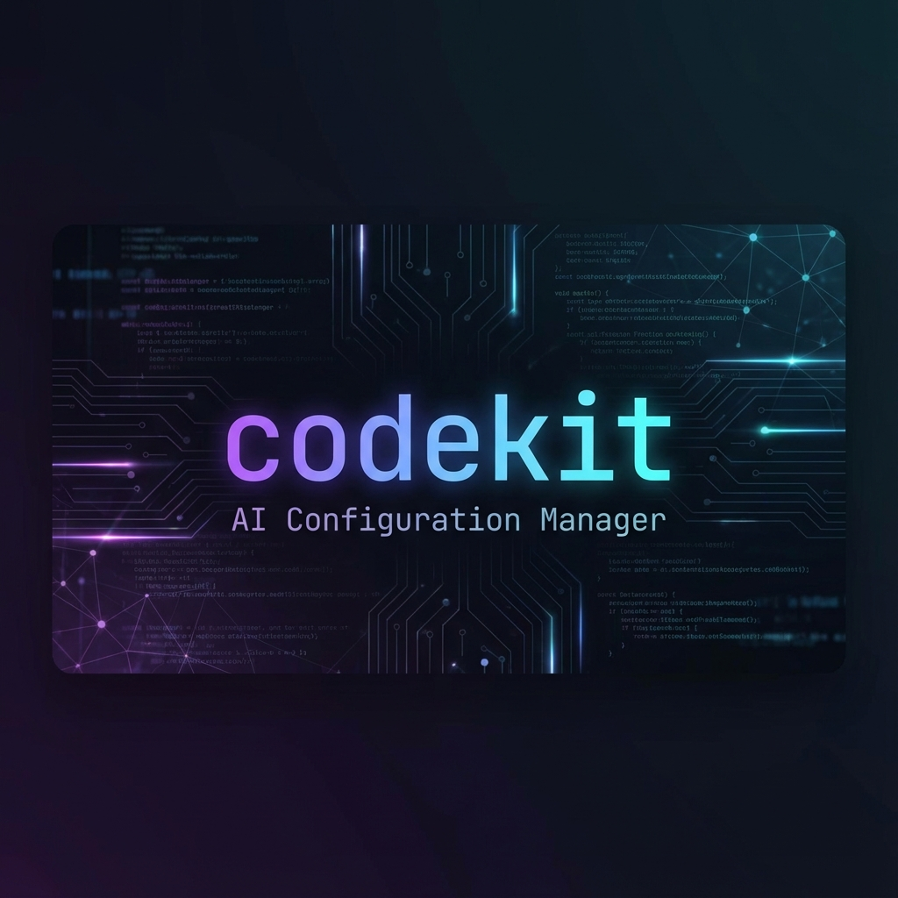

# codekit



> **Give your AI the skills it actually needs.** One CLI. 49 expert skills. Every AI platform.

---

Stop copy-pasting prompts. Stop losing context between sessions. Stop configuring each AI tool separately.

**codekit** turns your AI assistant into a domain expert that knows your stack, remembers your decisions, and follows your team's conventions — across Claude Code, Cursor, and Gemini CLI — from a single source of truth.

## The Problem

You're using AI coding assistants, but:

- Every new session starts from zero — your AI forgets everything
- Claude, Cursor, and Gemini each need their own config files maintained separately
- Your AI doesn't know your architecture, your patterns, or your conventions
- Installing "context" means pasting massive prompts that eat your token budget
- There's no structure to how your AI approaches tasks — it just wings it

## The Solution

```bash
codekit init          # Set up your project
codekit learn --all   # AI scans your codebase and generates rules for every platform
```

That's it. Your AI now understands your project.

Then tell your AI: **"setup skills for this project"** — it auto-detects your stack and installs exactly the right skills:

```
Detected: TypeScript, Next.js 15, Prisma, TanStack Query, Vitest, ESLint
Project type: Fullstack

Skills to install (14):
  Always:    memory-bank, agents, git-expert
  Auto-gen:  cook (customized for fullstack — Next.js + Prisma)
  Framework: nextjs, typescript-expert
  Frontend:  uiux-design-expert, vercel-react-best-practices, vercel-composition-patterns,
             framer-motion, shadcn-ui, chrome-devtools
  Database:  database-expert
  Tooling:   testing-expert, linting-expert

Proceed? (Y/n)
```

One command. Zero configuration. Your AI now has expert-level knowledge of every technology in your stack.

---

## What Makes codekit Different

### The Setup Skill — Zero-Config Onboarding

The `setup` skill is codekit's brain. It scans your project files — `package.json`, `pyproject.toml`, `Cargo.toml`, `go.mod`, and 10+ other ecosystems — to identify your exact stack, then maps each technology to the right expert skills.

**What it detects:**

| Layer | Signals |
|-------|---------|
| **Language** | TypeScript, Python, Go, Rust, Ruby, PHP, .NET, Java/Kotlin, Swift, Elixir, C/C++ |
| **Framework** | Next.js, React, Vue, Svelte, NestJS, ElysiaJS, FastAPI, Expo, React Native |
| **Database** | Prisma, Drizzle, TypeORM, SQLAlchemy, Mongoose, pgvector |
| **Tooling** | ESLint, Prettier, Jest, Vitest, pytest, ruff, GitHub Actions |
| **Project Type** | Backend, Frontend, Mobile, Fullstack, CLI, Library |

**What it does:**

1. **Detect** — Scans project root for config files and dependencies
2. **Match** — Maps detected technologies to codekit skills using lookup tables
3. **Confirm** — Shows you the proposed skill set before installing
4. **Install** — Runs `codekit skills add` for each match
5. **Generate** — Creates a custom `cook` workflow tailored to your actual frameworks and commands
6. **Sync** — Regenerates platform rules (`CLAUDE.md`, `.cursorrules`, `GEMINI.md`) with installed skills

The setup skill also suggests related skills from the mesh network that you might want — so you discover capabilities you didn't know existed.

### Skill Mesh Network

Skills aren't isolated — they form a **connected graph** of 49 skills and 150+ relationships. Every skill declares what it enhances, what complements it, and what it's an alternative to.

Three relationship types:

| Type | Meaning | Example |
|------|---------|---------|
| **enhances** | Makes another skill more effective | `typescript-expert` enhances `react` |
| **complementary** | Works well alongside | `framer-motion` + `uiux-design-expert` |
| **alternative** | Use one or the other | `react` vs `nextjs` |

The mesh is **bidirectional** — if `typescript-expert` enhances `react`, then `react` shows `typescript-expert` as a related skill too.

```bash
codekit skills related react

# Enhances:
#   TypeScript Expert (typescript-expert)
#   Testing Expert (testing-expert)
# Complementary:
#   UI/UX Design Expert (uiux-design-expert)
#   Framer Motion (framer-motion)
#   shadcn/ui (shadcn-ui)
#   Vercel React Best Practices (vercel-react-best-practices)
#   Vercel Composition Patterns (vercel-composition-patterns)
#   Chrome DevTools MCP (chrome-devtools)
# Alternatives:
#   Next.js Expert (nextjs)
```

When you install a skill, codekit surfaces its neighbors so you can build a complete toolkit. The setup skill uses the mesh to suggest related skills you might want after auto-detection.

See the full graph: [`docs/skill-graph.md`](docs/skill-graph.md)

### Progressive Disclosure — Zero Token Waste

50+ skills installed. Only the ones you need get loaded:

```
Level 1: Metadata     ->  Level 2: Instructions  ->  Level 3: Resources
 (~100 tokens/skill)       (~2K tokens on use)         (Unlimited, as needed)
```

Install everything. Pay for nothing until you use it.

### Adaptive Cook Workflows

Not a generic "plan and build" prompt. **Six project-specific workflows** that match how you actually work:

| Project | Workflow | Cook Skill |
|---------|----------|------------|
| **Backend** (NestJS, ElysiaJS, FastAPI) | Plan → Code → Review → Test | `cook-backend` |
| **Frontend** (React, Vue, Svelte) | Plan → Design → Code → Review → Test | `cook-frontend` |
| **Mobile** (React Native, Expo) | Plan → Design → Code → Review → Test | `cook-mobile` |
| **Fullstack** (Next.js, Nuxt, SvelteKit) | Plan → Design → Code API → Code UI → Review → Test | `cook-fullstack` |
| **CLI** (Commander, Yargs) | Plan → Code → Review → Test | `cook-cli` |
| **Library** (npm packages) | Plan → Design → Code → Review → Test | `cook-library` |

The **setup** skill auto-detects your project type and installs the right workflow. Backend API? You get `cook-backend`. Next.js app? You get `cook-fullstack`. No configuration needed.

### Memory Bank — Your AI Never Forgets

Every Cook workflow reads `memory-bank/` at session start and updates it when done:

```
memory-bank/
├── projectbrief.md    # What you're building and why
├── productContext.md   # Problem and solution context
├── techContext.md      # Stack, dependencies, setup
├── systemPatterns.md   # Architecture decisions
├── activeContext.md    # What's in progress right now
└── progress.md         # What's done, what's blocked
```

Session 1: Build the auth system. Session 47: Your AI still knows the auth system exists, what patterns you chose, and what's left to do.

### Multi-Platform Sync

Write once, deploy everywhere:

| Platform | Config File | Status |
|----------|-------------|--------|
| **AGENTS.md** | `AGENTS.md` | Full support — universal standard, works with 25+ AI agents |
| **Claude Code** | `CLAUDE.md` | Full support |
| **Cursor** | `.cursorrules` | Full support |
| **Gemini CLI** | `GEMINI.md` | Full support |

```bash
codekit learn --all   # Generate AGENTS.md + CLAUDE.md + .cursorrules + GEMINI.md
codekit sync          # Regenerate all platform configs from current project state
```

**AGENTS.md** is the [open standard](https://agents.md) adopted by 60,000+ repos. It works with any AI agent — Claude, Copilot, Cursor, Devin, Windsurf, Cline, Aider, and more. codekit generates it alongside platform-specific files so you're covered everywhere.

---

## Quick Start

### 1. Initialize

```bash
codekit init
```

Interactive setup — pick your skills and commands. The **setup** skill is pre-selected and will auto-detect your stack.

### 2. Learn Your Project

```bash
codekit learn --all
```

Scans your codebase: languages, frameworks, dependencies, project structure, scripts. Generates `CLAUDE.md`, `.cursorrules`, `GEMINI.md`, and `memory-bank/` in seconds.

### 3. Setup Skills

```bash
# Tell your AI: "setup skills for this project"
# The setup skill auto-detects your stack and installs matching skills

# Or install manually
codekit skills add typescript-expert
codekit skills add cook-backend
codekit skills related typescript-expert   # Discover related skills
```

The setup skill handles everything — detection, matching, installation, cook workflow generation, and platform sync. One command turns a blank project into a fully-configured AI workspace.

### 4. Work

Your AI now has expert knowledge, structured workflows, persistent memory, and platform-synced rules. Just build.

---

## 49 Bundled Skills

### Architecture & Patterns

| Skill | What It Brings |
|-------|---------------|
| `clean-architecture-ddd` | Domain-Driven Design with Clean Architecture — entities, aggregates, use cases, dependency rule |
| `domain-driven-hexagon` | DDD + Hexagonal Architecture + CQRS — vertical slices, ports & adapters, domain events |

### Backend

| Skill | What It Brings |
|-------|---------------|
| `fastapi` | Python FastAPI expert — async APIs, SQLAlchemy 2.0, Pydantic v2, uv |
| `python-fastapi` | Python FastAPI project structure and production patterns |
| `elysiajs-ddd` | ElysiaJS + DDD + Prisma + Better Auth on Bun runtime |
| `elysiajs-ddd-mongoose` | ElysiaJS + DDD + MongoDB/Mongoose + Better Auth on Bun |

### Frontend

| Skill | What It Brings |
|-------|---------------|
| `react` | React + Vite + TanStack (Query, Table, Router) + shadcn/ui + Zustand + Zod |
| `nextjs` | Next.js 15 App Router, Server Components, Server Actions, fullstack patterns |
| `uiux-design-expert` | Design systems, glassmorphism, neumorphism, brutalism, accessibility |
| `web-design-guidelines` | Web Interface Guidelines compliance and auditing |
| `vercel-react-best-practices` | React/Next.js performance optimization from Vercel Engineering |
| `vercel-composition-patterns` | Component composition patterns that scale — compound components, render props |
| `framer-motion` | Framer Motion performance — 42 rules for animations, gestures, layout, scroll, SVG |
| `shadcn-ui` | shadcn/ui component management — add, configure, and use 50+ Radix-based components |
| `slidev` | Slidev presentations — Markdown slides with Vue 3, animations, code highlighting, LaTeX, Mermaid |

### Auth

| Skill | What It Brings |
|-------|---------------|
| `better-auth` | Better Auth integration — OAuth, 2FA, sessions, organizations, security hardening |

### Mobile

| Skill | What It Brings |
|-------|---------------|
| `react-native` | React Native CLI bare workflow, native modules, platform-specific code |
| `react-native-expo` | Expo managed workflow, Expo Router, rapid mobile development |
| `react-native-best-practices` | Performance: FPS, TTI, bundle size, Hermes, FlashList, animations |
| `vercel-react-native-skills` | React Native + Expo best practices for performant mobile apps |
| `mobile-app-distribution` | App Store + Google Play publishing, signing, review guidelines |

### Database

| Skill | What It Brings |
|-------|---------------|
| `database-expert` | Schema design, query optimization across PostgreSQL, MySQL, MongoDB |
| `pgvector` | Vector similarity search for Postgres — HNSW, IVFFlat, hybrid search |
| `zvec` | Zvec vector database — collections, embeddings, similarity search |

### Workflow & Orchestration

| Skill | What It Brings |
|-------|---------------|
| `cook` | Auto-generated workflow orchestration based on detected project type |
| `cook-backend` | Backend workflow: Plan → Code → Review → Test |
| `cook-frontend` | Frontend workflow: Plan → Design → Code → Review → Test |
| `cook-mobile` | Mobile workflow: Plan → Design → Code → Review → Test |
| `cook-fullstack` | Fullstack workflow: Plan → Design → Code API → Code UI → Review → Test |
| `cook-cli` | CLI workflow: Plan → Code → Review → Test |
| `cook-library` | Library workflow: Plan → Design → Code → Review → Test |
| `memory-bank` | Persistent project documentation across sessions |
| `agents` | AGENTS.md — universal AI agent configuration standard |
| `setup` | Auto-detect project stack and install matching skills |
| `skill-creator` | Create new skills with proper structure and conventions |
| `figma-make-website-builder` | 9-phase workflow for production websites with Figma Make |

### DevOps & Tooling

| Skill | What It Brings |
|-------|---------------|
| `git-expert` | Merge conflicts, branching strategies, history rewriting |
| `github` | GitHub patterns — PRs, stacked PRs, code review, gh CLI |
| `github-actions` | CI/CD workflows, security, caching, matrix strategies |
| `terraform` | Terraform/OpenTofu — modules, testing, CI/CD, security scanning, state management |
| `chrome-devtools` | Browser automation, debugging, performance via MCP |
| `cli-expert` | CLI development — Unix philosophy, argument parsing, interactive modes |
| `typescript-expert` | Type system mastery, generics, module resolution, compiler config |
| `testing-expert` | Jest/Vitest, mocking, test architecture, TDD patterns |
| `linting-expert` | ESLint, Prettier, static analysis, coding standards |
| `eslint-fix` | Automated ESLint error analysis and fixing with iterative verification |

### Data & Documents

| Skill | What It Brings |
|-------|---------------|
| `data-analysis` | Data science, ML, Python data tools, statistics, NLP, time series, MLOps |
| `data-visualization` | Charts, graphs, and visualizations from data |
| `pdf-processing` | PDF text extraction, form filling, document merging |

---

## Stack Detection & Setup

The **setup** skill scans your project files, identifies every technology in your stack, and maps them to expert skills. It also detects your **project type** (backend, frontend, mobile, fullstack, CLI, library) to generate a matching Cook workflow. Here's what it recognizes:

### Fully Supported Stacks

| Stack | Auto-Installed Skills |
|-------|----------------------|
| **Python + FastAPI + uv** | `fastapi`, `python-fastapi`, `database-expert`, `cook-backend` |
| **NestJS + PostgreSQL** | `typescript-expert`, `database-expert`, `clean-architecture-ddd`, `domain-driven-hexagon`, `cook-backend` |
| **Bun + ElysiaJS + MongoDB** | `elysiajs-ddd-mongoose`, `typescript-expert`, `database-expert`, `cook-backend` |
| **Bun + ElysiaJS + PostgreSQL** | `elysiajs-ddd`, `typescript-expert`, `database-expert`, `cook-backend` |
| **Next.js + React** | `nextjs`, `typescript-expert`, `vercel-react-best-practices`, `vercel-composition-patterns`, `cook-fullstack` |
| **React SPA** | `react`, `typescript-expert`, `uiux-design-expert`, `web-design-guidelines`, `cook-frontend` |
| **React Native + Expo** | `react-native-expo`, `react-native-best-practices`, `mobile-app-distribution`, `cook-mobile` |
| **CLI tools** | `cli-expert`, `typescript-expert`, `cook-cli` |

### Recommended React Stack

When React or Next.js is detected, setup recommends the following libraries if not already present:

| Library | Purpose |
|---------|---------|
| TanStack Query | Server state & data fetching |
| TanStack Table | Headless table/datagrid |
| Zod | Schema validation |
| Zustand | Client state management |
| Axios | HTTP client |
| React Hook Form | Form handling |
| Recharts | Charts (when needed) |

### Other Languages

Go, Rust, Ruby, PHP, .NET, Java/Kotlin, Swift, Elixir, C/C++ — detected and matched with baseline skills (`memory-bank`, `git-expert`, `testing-expert`, appropriate cook variant).

---

## CLI Reference

### `codekit init`

```bash
codekit init              # Interactive setup with skill selection
codekit init --yes        # Accept all defaults
codekit init --global     # Initialize ~/.claude (%USERPROFILE%\.claude on Windows)
codekit init --dry-run    # Preview without writing
codekit init --force      # Overwrite existing
```

### `codekit learn`

```bash
codekit learn             # Interactive — choose platforms
codekit learn --all       # Generate for Claude + Cursor + Gemini
codekit learn -p claude   # Specific platform
codekit learn --dry-run   # Preview
```

Detects 10+ language ecosystems:

| Language | Package Files |
|----------|---------------|
| JavaScript/TypeScript | `package.json` |
| Python | `pyproject.toml`, `requirements.txt`, `Pipfile`, `setup.py` |
| Rust | `Cargo.toml` |
| Go | `go.mod` |
| Ruby | `Gemfile` |
| Java/Kotlin | `pom.xml`, `build.gradle`, `build.gradle.kts` |
| PHP | `composer.json` |
| .NET | `*.csproj` |
| Swift | `Package.swift` |
| Elixir | `mix.exs` |

### `codekit sync`

```bash
codekit sync                   # Regenerate all platform configs
codekit sync -p claude,cursor  # Specific platforms
codekit sync --force           # Overwrite without asking
```

### `codekit skills`

```bash
codekit skills list              # All skills with install status
codekit skills list --installed  # Only installed
codekit skills list --available  # Only not installed
codekit skills add <name>        # Install a skill
codekit skills add <name> -g     # Install globally
codekit skills remove <name>     # Uninstall
codekit skills related <name>    # Show skill mesh relationships
```

### `codekit commands`

```bash
codekit commands list             # All commands
codekit commands add git/commit   # Install a command
codekit commands remove <name>    # Uninstall
```

---

## How It Works

### Progressive Skill Loading

```
┌──────────────────────┐      ┌────────────────────────┐      ┌──────────────────────┐
│  Level 1: Metadata   │  ->  │  Level 2: Instructions │  ->  │  Level 3: Resources  │
│   (Always Loaded)    │      │    (Loaded on Use)     │      │     (As Needed)      │
└──────────────────────┘      └────────────────────────┘      └──────────────────────┘
   ~100 tokens/skill                ~2K tokens                     Unlimited
```

### Skill Mesh Network

49 skills connected by 150+ bidirectional relationships. Three relationship types:

- **enhances** — makes another skill more effective (e.g., `typescript-expert` enhances `react`)
- **complementary** — works well alongside (e.g., `framer-motion` + `uiux-design-expert`)
- **alternative** — use one or the other (e.g., `react` vs `nextjs`)

The mesh drives two key features:
1. **`codekit skills related <name>`** — discover what pairs well with any skill
2. **`setup` skill** — uses the mesh to suggest related skills after auto-detection

See the full Mermaid diagram: [`docs/skill-graph.md`](docs/skill-graph.md)

### Directory Structure

```
project/
├── .claude/
│   ├── skills/                    # Installed skills
│   │   ├── cook-fullstack/
│   │   │   └── SKILL.md
│   │   ├── typescript-expert/
│   │   │   └── SKILL.md
│   │   └── react/
│   │       ├── SKILL.md
│   │       └── references/        # Optional deep-dive docs
│   └── commands/                  # Slash commands
│       └── git/
│           └── commit.md
├── AGENTS.md                      # Universal AI agent config (agents.md standard)
├── CLAUDE.md                      # Generated rules for Claude Code
├── .cursorrules                   # Generated rules for Cursor
├── GEMINI.md                      # Generated rules for Gemini CLI
└── memory-bank/                   # Persistent project context
    ├── projectbrief.md
    ├── productContext.md
    ├── techContext.md
    ├── systemPatterns.md
    ├── activeContext.md
    └── progress.md
```

---

## Installation

### From Source

```bash
git clone <repo>
cd codekit
bun install
bun run dev -- <command>
```

### Compiled Binary

```bash
bun run build

# macOS / Linux
./dist/codekit-darwin-arm64 --version

# Windows
.\dist\codekit-windows-x64.exe --version
```

**Platforms:** macOS (ARM/x64), Linux (ARM/x64), Windows (x64)

> **Windows note:** codekit uses directory junctions (no admin privileges needed) for skill symlinks. All CLI paths adapt automatically — `--global` targets `%USERPROFILE%\.claude` instead of `~/.claude`.

---

## Development

```bash
bun install                      # Install dependencies
bun run dev -- skills list       # Run in dev mode
bun run test                     # Run tests
bun run typecheck                # Type check
bun run build:vfs                # Regenerate template VFS
bun run build                    # Build binary
```

### Adding a New Skill

1. Create `templates/skills/<name>/SKILL.md`
2. Add entry to `templates/skills/index.json` (with `relatedSkills` for mesh connections)
3. Run `bun run build:vfs`

### Architecture

```
src/
├── index.ts                 # Entry point
├── cli.ts                   # Commander.js CLI setup
├── commands/
│   ├── skills/              # list, add, remove, related
│   ├── commands/            # list, add, remove
│   ├── init.ts              # Project initialization
│   ├── learn.ts             # Project scanning
│   └── sync.ts              # Multi-platform sync
├── core/
│   ├── resource-manager.ts  # Abstract base
│   ├── skill-manager.ts     # Skill operations
│   ├── command-manager.ts   # Command operations
│   └── template-loader.ts   # VFS template resolution
├── types/                   # TypeScript interfaces
└── utils/
    ├── skill-graph.ts       # Mesh network resolver
    ├── installed-skills.ts  # Installed skills scanner
    ├── platform-rules.ts    # Multi-platform rule generation
    ├── project-scanner.ts   # Codebase analysis
    ├── paths.ts             # Path resolution
    └── logger.ts            # Styled console output
```

## License

MIT
