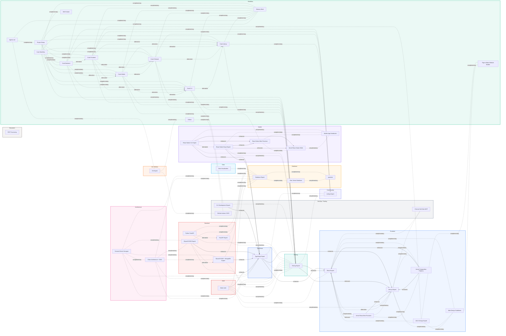

# Skill Mesh Network

43 skills across 14 categories with 130 relationships.

```mermaid
graph LR

  %% Relationship types:
  %%   ─── enhances (solid)
  %%   - - complementary (dashed)
  %%   ··· alternative (dotted)

  subgraph architecture["Architecture"]
    domain_driven_hexagon["Domain-Driven Hexagon"]
    clean_architecture_ddd["Clean Architecture + DDD"]
  end

  subgraph auth["Auth"]
    better_auth["Better Auth"]
  end

  subgraph backend["Backend"]
    python_fastapi["Python FastAPI"]
    fastapi["FastAPI Expert"]
    elysiajs_ddd["ElysiaJS DDD Expert"]
    elysiajs_ddd_mongoose["ElysiaJS DDD + MongoDB Expert"]
  end

  subgraph code_quality["Code Quality"]
    linting_expert["Linting Expert"]
  end

  subgraph data["Data"]
    data_visualization["Data Visualization"]
  end

  subgraph database["Database"]
    database_expert["Database Expert"]
    zvec["Zvec Vector Database"]
    pgvector["pgvector"]
  end

  subgraph devops["DevOps / Tooling"]
    cli_expert["CLI Development Expert"]
    chrome_devtools["Chrome DevTools MCP"]
    github_actions["GitHub Actions CI/CD"]
  end

  subgraph document["Document"]
    pdf_processing["PDF Processing"]
  end

  subgraph frontend["Frontend"]
    react["React Expert"]
    nextjs["Next.js Expert"]
    uiux_design_expert["UI/UX Design Expert"]
    web_design_guidelines["Web Design Guidelines"]
    vercel_composition_patterns["Vercel Composition Patterns"]
    vercel_react_best_practices["Vercel React Best Practices"]
  end

  subgraph git["Git / GitHub"]
    git_expert["Git Expert"]
  end

  subgraph mobile["Mobile"]
    react_native["React Native CLI Expert"]
    react_native_expo["React Native Expo Expert"]
    react_native_best_practices["React Native Best Practices"]
    vercel_react_native_skills["Vercel React Native Skills"]
    mobile_app_distribution["Mobile App Distribution"]
  end

  subgraph testing["Testing"]
    testing_expert["Testing Expert"]
  end

  subgraph typescript["TypeScript"]
    typescript_expert["TypeScript Expert"]
  end

  subgraph workflow["Workflow"]
    memory_bank["Memory Bank"]
    github["Github"]
    figma_make_website_builder["Figma Make Website Builder"]
    cook["Cook Workflow"]
    cook_backend["Cook Backend"]
    cook_frontend["Cook Frontend"]
    cook_mobile["Cook Mobile"]
    cook_fullstack["Cook Fullstack"]
    cook_cli["Cook CLI"]
    cook_library["Cook Library"]
    skill_creator["Skill Creator"]
    agents["Agents.md"]
    setup["Project Setup"]
  end

  %% Enhances (solid arrow)
  elysiajs_ddd -->|enhances| typescript_expert
  elysiajs_ddd_mongoose -->|enhances| typescript_expert
  typescript_expert -->|enhances| react
  typescript_expert -->|enhances| nextjs
  testing_expert -->|enhances| react
  testing_expert -->|enhances| nextjs
  cli_expert -->|enhances| typescript_expert
  react_native -->|enhances| react_native_best_practices
  react_native -->|enhances| vercel_react_native_skills
  react_native -->|enhances| typescript_expert
  react_native_expo -->|enhances| react_native_best_practices
  react_native_expo -->|enhances| vercel_react_native_skills
  react_native_expo -->|enhances| typescript_expert
  vercel_composition_patterns -->|enhances| react
  vercel_composition_patterns -->|enhances| nextjs
  vercel_react_best_practices -->|enhances| react
  vercel_react_best_practices -->|enhances| nextjs
  better_auth -->|enhances| typescript_expert

  %% Complementary (dashed)
  data_visualization -.-|complementary| database_expert
  python_fastapi -.-|complementary| database_expert
  python_fastapi -.-|complementary| testing_expert
  fastapi -.-|complementary| database_expert
  fastapi -.-|complementary| testing_expert
  domain_driven_hexagon -.-|complementary| clean_architecture_ddd
  domain_driven_hexagon -.-|complementary| elysiajs_ddd
  domain_driven_hexagon -.-|complementary| elysiajs_ddd_mongoose
  domain_driven_hexagon -.-|complementary| typescript_expert
  domain_driven_hexagon -.-|complementary| testing_expert
  domain_driven_hexagon -.-|complementary| database_expert
  clean_architecture_ddd -.-|complementary| elysiajs_ddd
  clean_architecture_ddd -.-|complementary| elysiajs_ddd_mongoose
  clean_architecture_ddd -.-|complementary| typescript_expert
  clean_architecture_ddd -.-|complementary| testing_expert
  clean_architecture_ddd -.-|complementary| database_expert
  elysiajs_ddd -.-|complementary| database_expert
  elysiajs_ddd -.-|complementary| testing_expert
  elysiajs_ddd_mongoose -.-|complementary| database_expert
  elysiajs_ddd_mongoose -.-|complementary| testing_expert
  database_expert -.-|complementary| pgvector
  database_expert -.-|complementary| zvec
  typescript_expert -.-|complementary| linting_expert
  typescript_expert -.-|complementary| testing_expert
  testing_expert -.-|complementary| linting_expert
  git_expert -.-|complementary| github
  git_expert -.-|complementary| github_actions
  react -.-|complementary| uiux_design_expert
  react -.-|complementary| vercel_react_best_practices
  react -.-|complementary| vercel_composition_patterns
  react -.-|complementary| web_design_guidelines
  react -.-|complementary| chrome_devtools
  nextjs -.-|complementary| uiux_design_expert
  nextjs -.-|complementary| vercel_react_best_practices
  nextjs -.-|complementary| vercel_composition_patterns
  nextjs -.-|complementary| web_design_guidelines
  nextjs -.-|complementary| chrome_devtools
  uiux_design_expert -.-|complementary| web_design_guidelines
  uiux_design_expert -.-|complementary| figma_make_website_builder
  cli_expert -.-|complementary| testing_expert
  react_native -.-|complementary| mobile_app_distribution
  react_native -.-|complementary| testing_expert
  react_native_expo -.-|complementary| mobile_app_distribution
  react_native_expo -.-|complementary| testing_expert
  react_native_best_practices -.-|complementary| vercel_react_native_skills
  react_native_best_practices -.-|complementary| mobile_app_distribution
  github -.-|complementary| github_actions
  web_design_guidelines -.-|complementary| figma_make_website_builder
  vercel_composition_patterns -.-|complementary| vercel_react_best_practices
  vercel_react_native_skills -.-|complementary| mobile_app_distribution
  zvec -.-|complementary| pgvector
  cook -.-|complementary| cook_backend
  cook -.-|complementary| cook_frontend
  cook -.-|complementary| cook_mobile
  cook -.-|complementary| cook_fullstack
  cook -.-|complementary| cook_cli
  cook -.-|complementary| cook_library
  cook -.-|complementary| testing_expert
  cook -.-|complementary| memory_bank
  cook_backend -.-|complementary| testing_expert
  cook_backend -.-|complementary| linting_expert
  cook_backend -.-|complementary| memory_bank
  cook_frontend -.-|complementary| testing_expert
  cook_frontend -.-|complementary| linting_expert
  cook_frontend -.-|complementary| uiux_design_expert
  cook_frontend -.-|complementary| memory_bank
  cook_mobile -.-|complementary| testing_expert
  cook_mobile -.-|complementary| react_native_best_practices
  cook_mobile -.-|complementary| memory_bank
  cook_fullstack -.-|complementary| testing_expert
  cook_fullstack -.-|complementary| linting_expert
  cook_fullstack -.-|complementary| memory_bank
  cook_cli -.-|complementary| testing_expert
  cook_cli -.-|complementary| cli_expert
  cook_cli -.-|complementary| memory_bank
  cook_library -.-|complementary| testing_expert
  cook_library -.-|complementary| linting_expert
  cook_library -.-|complementary| memory_bank
  better_auth -.-|complementary| nextjs
  better_auth -.-|complementary| react
  better_auth -.-|complementary| database_expert
  better_auth -.-|complementary| testing_expert
  agents -.-|complementary| memory_bank
  agents -.-|complementary| setup
  agents -.-|complementary| git_expert
  setup -.-|complementary| memory_bank
  setup -.-|complementary| cook_backend
  setup -.-|complementary| cook_frontend
  setup -.-|complementary| cook_mobile
  setup -.-|complementary| cook_fullstack
  setup -.-|complementary| cook_cli
  setup -.-|complementary| cook_library
  setup -.-|complementary| skill_creator

  %% Alternative (dotted, red)
  python_fastapi -.->|alternative| fastapi
  elysiajs_ddd -.->|alternative| elysiajs_ddd_mongoose
  react -.->|alternative| nextjs
  react_native -.->|alternative| react_native_expo
  cook_backend -.->|alternative| cook_frontend
  cook_backend -.->|alternative| cook_mobile
  cook_backend -.->|alternative| cook_fullstack
  cook_backend -.->|alternative| cook_cli
  cook_backend -.->|alternative| cook_library
  cook_frontend -.->|alternative| cook_mobile
  cook_frontend -.->|alternative| cook_fullstack
  cook_frontend -.->|alternative| cook_cli
  cook_frontend -.->|alternative| cook_library
  cook_mobile -.->|alternative| cook_fullstack
  cook_mobile -.->|alternative| cook_cli
  cook_mobile -.->|alternative| cook_library
  cook_fullstack -.->|alternative| cook_cli
  cook_fullstack -.->|alternative| cook_library
  cook_cli -.->|alternative| cook_library

  %% Category styles
  style architecture fill:#ec489915,stroke:#ec4899,stroke-width:2px
  style auth fill:#dc262615,stroke:#dc2626,stroke-width:2px
  style backend fill:#ef444415,stroke:#ef4444,stroke-width:2px
  style code_quality fill:#6366f115,stroke:#6366f1,stroke-width:2px
  style data fill:#0ea5e915,stroke:#0ea5e9,stroke-width:2px
  style database fill:#f59e0b15,stroke:#f59e0b,stroke-width:2px
  style devops fill:#64748b15,stroke:#64748b,stroke-width:2px
  style document fill:#78716c15,stroke:#78716c,stroke-width:2px
  style frontend fill:#3b82f615,stroke:#3b82f6,stroke-width:2px
  style git fill:#f9731615,stroke:#f97316,stroke-width:2px
  style mobile fill:#8b5cf615,stroke:#8b5cf6,stroke-width:2px
  style testing fill:#14b8a615,stroke:#14b8a6,stroke-width:2px
  style typescript fill:#2563eb15,stroke:#2563eb,stroke-width:2px
  style workflow fill:#10b98115,stroke:#10b981,stroke-width:2px
```
