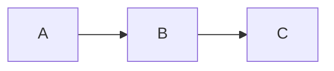
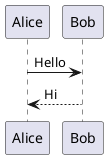

# Slidev Presentation Framework

## Quick Start

```bash
# Create new project
pnpm create slidev          # or npm init slidev@latest / bun create slidev

# Single file mode
pnpm i -g @slidev/cli
slidev slides.md

# Dev / Build / Export
slidev                      # start dev server
slidev build                # build static SPA → dist/
slidev export               # export to PDF (default)
slidev export --format pptx # export to PowerPoint
slidev export --format png  # export to PNGs
slidev format               # format slides file
```

## Tech Stack

Vite + Vue 3 + Markdown | UnoCSS (Tailwind-compatible) | Shiki (syntax highlighting) | Monaco Editor | KaTeX (LaTeX) | Mermaid/PlantUML (diagrams) | RecordRTC | VueUse | Iconify icons | Drauu (drawing)

## Slide Syntax

### Separators & Frontmatter

```md
---
theme: seriph
title: My Presentation
transition: slide-left
---

# First Slide (cover)

Content here

---

# Second Slide

More content

---
layout: two-cols
---

# Third Slide

Left column content

::right::

Right column content
```

**Headmatter** (first `---` block) = global config. **Frontmatter** (per-slide `---` blocks) = slide config.

### Key Headmatter Properties

| Property | Type | Description |
|----------|------|-------------|
| `theme` | string | Theme name (e.g., `seriph`, `apple-basic`) |
| `title` | string | Presentation title |
| `transition` | string | Slide transition effect |
| `layout` | string | Default layout |
| `exportFilename` | string | Export output filename |
| `drawings` | object | Drawing/annotation config |
| `monaco` | boolean | Enable Monaco editor |
| `codeCopy` | boolean | Show copy button on code blocks |
| `record` | boolean/string | Enable recording |
| `colorSchema` | string | `'dark'` \| `'light'` \| `'all'` |

### Presenter Notes

```md
---

# Slide Title

Content visible to audience

<!-- Speaker notes go here. Supports **markdown** -->
```

### Importing External Slides

```yaml
---
src: ./pages/intro.md
---
```

## Built-in Layouts

| Layout | Purpose | Special Props |
|--------|---------|---------------|
| `default` | General content | — |
| `cover` | Title/cover page | — |
| `center` | Centered content | — |
| `intro` | Introduction slide | — |
| `section` | Section divider | — |
| `statement` | Bold statement | — |
| `quote` | Quotation display | — |
| `fact` | Data prominence | — |
| `full` | Full-screen content | — |
| `end` | Final slide | — |
| `image` | Full image | `image` |
| `image-left` | Image left, text right | `image`, `class` |
| `image-right` | Image right, text left | `image`, `class` |
| `iframe` | Embedded webpage | `url` |
| `iframe-left` | Iframe left, text right | `url`, `class` |
| `iframe-right` | Iframe right, text left | `url`, `class` |
| `two-cols` | Two columns | Uses `::right::` separator |
| `two-cols-header` | Header + two columns | Uses `::left::` and `::right::` |
| `none` | No styling (blank canvas) | — |

### Layout Slot Syntax

```md
---
layout: two-cols
---

# Left Column

Content for left side

::right::

# Right Column

Content for right side
```

## Click Animations

### v-click — Reveal on Click

```html
<v-click>Appears after 1 click</v-click>
<div v-click>Also works as directive</div>
<div v-click.hide>Disappears on click</div>
```

### v-after — Reveal with Previous

```html
<div v-click>First item</div>
<div v-after>Appears with first item</div>
```

### v-clicks — Animate All Children

```html
<v-clicks>

- Item 1
- Item 2
- Item 3

</v-clicks>
```

Props: `depth` (nested list depth), `every` (items per click)

### Click Positioning

```html
<!-- Relative (default +1) -->
<div v-click>Click 1</div>
<div v-click>Click 2</div>
<v-click at="+2">Click 4 (skipped 3)</v-click>

<!-- Absolute -->
<div v-click="3">Appears at click 3</div>

<!-- Range [enter, leave] -->
<div v-click="[2, 4]">Visible at clicks 2-3</div>
```

### v-switch — Template Switching

```html
<v-switch>
  <template #1>Shown at click 1</template>
  <template #2>Shown at click 2</template>
  <template #3>Shown at click 3</template>
</v-switch>
```

### Transition Classes

```css
/* Customize click animation */
.slidev-vclick-target {
  transition: all 500ms ease;
}
.slidev-vclick-hidden {
  transform: scale(0);
  opacity: 0;
}
```

## Code Features

### Syntax Highlighting (Shiki)

````md
```ts
console.log('Hello')
```
````

### Line Highlighting

````md
```ts {2,3}
// Not highlighted
const a = 1  // Highlighted
const b = 2  // Highlighted
```
````

### Dynamic Highlighting (click-based)

````md
```ts {2-3|5|all}
function add(
  a: Ref<number>,    // Step 1: highlight 2-3
  b: Ref<number>
) {
  return computed(() => unref(a) + unref(b))  // Step 2: highlight 5
}
```
````

### Shiki Magic Move — Animated Code Transitions

`````md
````md magic-move {lines: true}
```js
const count = 1
```
```js
const count = 1
const doubled = count * 2
```
```js
const count = 1
const doubled = count * 2
console.log(doubled)
```
````
`````

Config: `magicMoveDuration: 800` (ms), per-block `{duration:500}`

### Monaco Editor — Live Editing

````md
```ts {monaco}
console.log('Editable in presentation!')
```
````

Monaco diff mode:

````md
```ts {monaco-diff}
console.log('Original')
~~~
console.log('Modified')
```
````

Height: `{monaco} {height:'auto'}` or `{height:'300px'}`

### Line Numbers

````md
```ts {lines:true}
// Line numbers shown
const x = 1
```
````

### Title Bar

````md
```ts [app.ts]
// Shows "app.ts" title bar with file icon
export const app = createApp()
```
````

## Slide Transitions

```yaml
---
transition: slide-left
---
```

Built-in: `fade` | `slide-left` | `slide-right` | `slide-up` | `slide-down` | `view-transition`

Directional: `transition: go-forward | go-backward`

## Motion Animations

```html
<div v-motion
  :initial="{ x: -80, opacity: 0 }"
  :enter="{ x: 0, opacity: 1 }">
  Animated element
</div>

<!-- Click-triggered motion -->
<div v-motion
  :initial="{ x: -80 }"
  :click-1="{ x: 0, y: 30 }"
  :click-2="{ y: 60 }">
  Step-by-step motion
</div>
```

## LaTeX / KaTeX

Inline: `$\sqrt{3x-1}+(1+x)^2$`

Block:
```
$$
\nabla \times \vec{E} = -\frac{\partial \vec{B}}{\partial t}
$$
```

Chemical (requires mhchem): `$\ce{H2O}$`

## Diagrams

### Mermaid

````md

````

### PlantUML

````md

````

## Themes & Addons

### Using Themes

```yaml
---
theme: seriph
---
```

Auto-installs if not found. Browse: [Theme Gallery](https://sli.dev/resources/theme-gallery)

### Using Addons

```yaml
---
addons:
  - excalidraw
  - '@slidev/plugin-notes'
---
```

## Key Components

| Component | Purpose |
|-----------|---------|
| `<Arrow>` | Draw arrows (`x1`, `y1`, `x2`, `y2`, `width`, `color`, `two-way`) |
| `<AutoFitText>` | Auto-sizing text container |
| `<LightOrDark>` | Conditional dark/light rendering |
| `<Link to="42">` | Navigate to slide |
| `<RenderWhen context="presenter">` | Context-conditional rendering |
| `<SlideCurrentNo>` | Current slide number |
| `<SlidesTotal>` | Total slide count |
| `<Toc>` | Table of contents |
| `<Transform :scale="0.5">` | CSS transform wrapper |
| `<Tweet id="20">` | Embed tweet |
| `<SlidevVideo>` | Video player (`autoplay`, `controls`, `autoreset`) |
| `<Youtube id="...">` | YouTube embed |
| `<v-drag>` | Draggable container |
| `<v-drag-arrow>` | Draggable arrow |

## Project Structure

```
your-slidev/
├── components/       # Custom Vue components (auto-imported)
├── layouts/          # Custom layouts (extend built-in)
├── public/           # Static assets (images, fonts)
├── setup/            # Setup hooks and extensions
├── snippets/         # Reusable code snippets
├── styles/           # Custom CSS (UnoCSS + PostCSS)
├── global-top.vue    # Global layer above all slides
├── global-bottom.vue # Global layer below all slides
├── slide-top.vue     # Per-slide top layer
├── slide-bottom.vue  # Per-slide bottom layer
├── custom-nav-controls.vue  # Custom navigation controls
├── index.html        # HTML injection (head/body)
├── slides.md         # Main presentation file
└── vite.config.ts    # Vite configuration extensions
```

## Global Context (Vue)

Access in any component or slide:

| Variable | Description |
|----------|-------------|
| `$slidev` | Main context (configs, themeConfigs) |
| `$frontmatter` | Current slide's frontmatter data |
| `$nav` | Navigation controller |
| `$nav.next()` | Advance one step |
| `$nav.nextSlide()` | Jump to next slide |
| `$nav.go(10)` | Go to slide 10 |
| `$nav.currentPage` | Current page number |
| `$clicks` | Click count on current slide |
| `$page` | Current page (1-indexed) |
| `$renderContext` | `'slide'` \| `'overview'` \| `'presenter'` \| `'previewNext'` |

Composables:
```ts
import { useNav, useDarkMode, useIsSlideActive, onSlideEnter, onSlideLeave } from '@slidev/client'
```

## Export & Hosting

### Export

```bash
slidev export                          # PDF (default)
slidev export --format pptx            # PowerPoint (images, includes notes)
slidev export --format png             # PNG per slide
slidev export --format md              # Markdown with embedded PNGs
slidev export --with-clicks            # Export click steps as pages
slidev export --range 1,6-8,10         # Specific slides
slidev export --dark                   # Dark mode
slidev export --with-toc               # PDF outline
slidev export --output my-slides       # Custom filename
slidev export --timeout 60000          # Increase timeout
```

Requires: `playwright-chromium` for CLI export

### Build & Host

```bash
slidev build                           # → dist/
slidev build --base /talks/my-talk/    # Sub-path deployment
slidev build --out my-build            # Custom output dir
slidev build --without-notes           # Remove speaker notes
```

Deploy to: **Netlify** | **Vercel** | **GitHub Pages** | **Docker** (`tangramor/slidev:latest`)

## Draggable Elements

```html
<!-- Directive with frontmatter position -->


<!-- Component -->
<v-drag pos="100,200,150,150" text-3xl>
  Drag me!
</v-drag>

<!-- Draggable arrow -->
<v-drag-arrow />
```

Controls: double-click to drag, arrow keys to move, Shift+drag to preserve ratio

## Reference Files

| File | Contents |
|------|----------|
| `references/syntax-animations.md` | Full markdown syntax, click system, transitions, motion |
| `references/code-features.md` | Code blocks, line highlighting, Magic Move, Monaco |
| `references/components-layouts.md` | All built-in components and layouts with props |
| `references/customization.md` | Directory structure, Vue context, global layers, config |
| `references/themes-addons.md` | Using/writing themes and addons |
| `references/export-deploy.md` | Exporting, building, hosting, CLI reference |
