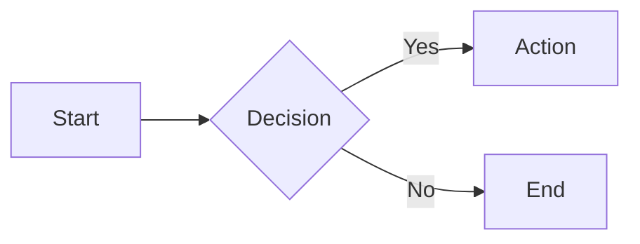
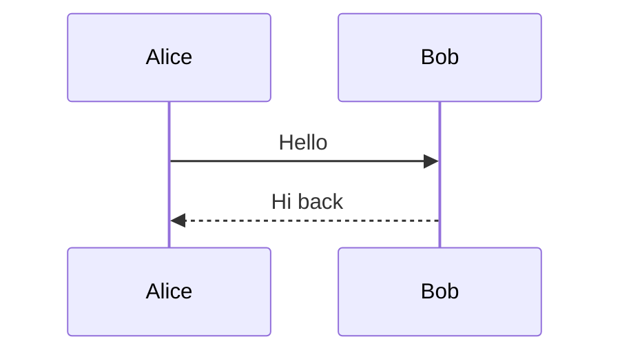
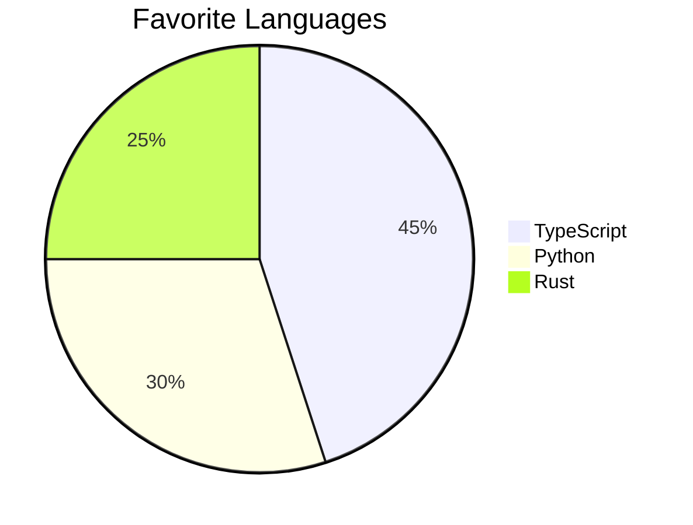
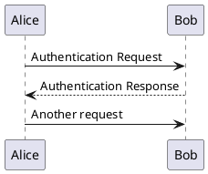

# Slidev Code Features Reference

## Syntax Highlighting (Shiki)

Basic code blocks with language specification:

````md
```ts
console.log('Hello, World!')
```

```python
print("Hello, World!")
```

```rust
fn main() {
    println!("Hello!");
}
```
````

## Line Numbers

````md
```ts {lines:true}
const a = 1
const b = 2
const c = a + b
```
````

Start from a specific line number:

````md
```ts {lines:true, startLine:5}
// This line shows as line 5
const x = 42
```
````

## Line Highlighting

### Static Highlighting

````md
```ts {2,3}
function greet(name: string) {
  const message = `Hello, ${name}`  // highlighted
  console.log(message)              // highlighted
}
```
````

### Range Syntax

| Syntax | Meaning |
|--------|---------|
| `{2}` | Line 2 |
| `{2,3}` | Lines 2 and 3 |
| `{2-5}` | Lines 2 through 5 |
| `{2,4-6}` | Lines 2, 4, 5, 6 |
| `{all}` | All lines |
| `{none}` | No highlighting |
| `{hide}` | Hide entire block |

### Dynamic Highlighting (Click-Based)

Pipe `|` separates click steps:

````md
```ts {2-3|5|all}
function add(
  a: Ref<number>,    // Step 1: lines 2-3
  b: Ref<number>
) {
  return computed(() => unref(a) + unref(b))  // Step 2: line 5
}                                              // Step 3: all lines
```
````

### Combined with Click Positioning

````md
```ts {*|1|2-5}{at:3}
// Highlighting starts at click 3
let count = 1
function add() {
  count++
}
```
````

## Title Bar

Show a filename header with file icon:

````md
```ts [app.ts]
export const app = createApp()
```

```vue [components/Header.vue]
<template>
  <header>My App</header>
</template>
```
````

## Max Height

Constrain tall code blocks:

````md
```ts {maxHeight:'200px'}
// Long code block with scrollbar
const a = 1
const b = 2
const c = 3
// ... many more lines
```
````

---

## Shiki Magic Move

Animated code transitions between steps. Uses 4 backticks:

`````md
````md magic-move
```js
console.log(`Step ${1}`)
```
```js
console.log(`Step ${1 + 1}`)
```
```js
console.log(`Step ${1 + 1 + 1}`)
```
````
`````

### With Line Highlighting and Numbers

`````md
````md magic-move {at:4, lines: true}
```js {*|1|2-5}
let count = 1
function add() {
  count++
}
```
```js
let count = 1
const doubled = count * 2
```
````
`````

### With Title Bar

`````md
````md magic-move
```js [app.js]
console.log('Step 1')
```
```js [app.js]
console.log('Step 1')
console.log('Step 2')
```
````
`````

### Configuration

**Global (headmatter):**
```yaml
---
magicMoveDuration: 500     # Animation duration in ms (default: 800)
magicMoveCopy: true        # Copy button: true | false | 'final'
---
```

**Per-block:**
`````md
````md magic-move {duration:500}
```js
// ...
```
````
`````

---

## Monaco Editor

### Live Editable Code

````md
```ts {monaco}
console.log('Edit me during the presentation!')
```
````

### Diff Mode

````md
```ts {monaco-diff}
console.log('Original text')
~~~
console.log('Modified text')
```
````

### Height Configuration

````md
```ts {monaco} {height:'auto'}
// Auto-growing editor
console.log('Expands as you type')
```

```ts {monaco} {height:'300px'}
// Fixed height editor
console.log('300px tall')
```

```ts {monaco} {height:'100%'}
// Full height
```
````

### Monaco Runner

Execute code in the editor with `{monaco-run}`:

````md
```ts {monaco-run}
console.log('This code can be executed!')
```
````

### Writable Monaco

Enable editing during presentation:

````md
```ts {monaco} {editable:true}
// Audience can edit this
let x = 1
```
````

---

## LaTeX / KaTeX

### Inline Math

```md
Einstein's equation: $E = mc^2$

The quadratic formula: $x = \frac{-b \pm \sqrt{b^2-4ac}}{2a}$
```

### Block Math

```md
$$
\nabla \times \vec{E} = -\frac{\partial \vec{B}}{\partial t}
$$
```

### Line Highlighting in LaTeX

```md
$$ {1|3|all}
\begin{aligned}
  a &= b + c \\
  d &= e + f \\
  g &= h + i
\end{aligned}
$$
```

### Chemical Formulas (mhchem)

Requires setup in `vite.config.ts`:
```ts
import 'katex/contrib/mhchem'
```

Then use:
```md
$\ce{H2O}$
$\ce{CO2 + H2O -> H2CO3}$
$\ce{B(OH)3 + H2O <--> B(OH)4^- + H+}$
```

---

## Diagrams

### Mermaid

````md





````

### PlantUML

````md

````

---

## Code Snippets Directory

Store reusable code in `./snippets/`:

```
snippets/
├── example.ts
├── demo.py
└── config.json
```

Reference in slides:

````md
<<< @/snippets/example.ts
````

With line highlighting:

````md
<<< @/snippets/example.ts {2-5}
````
